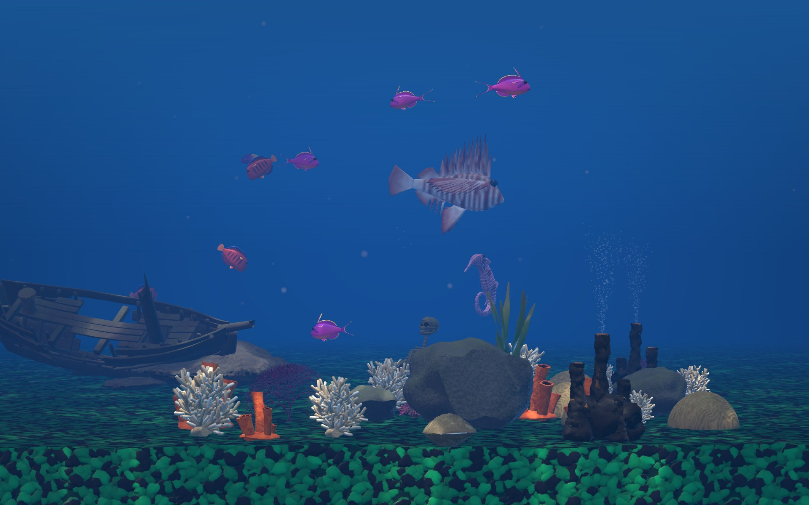
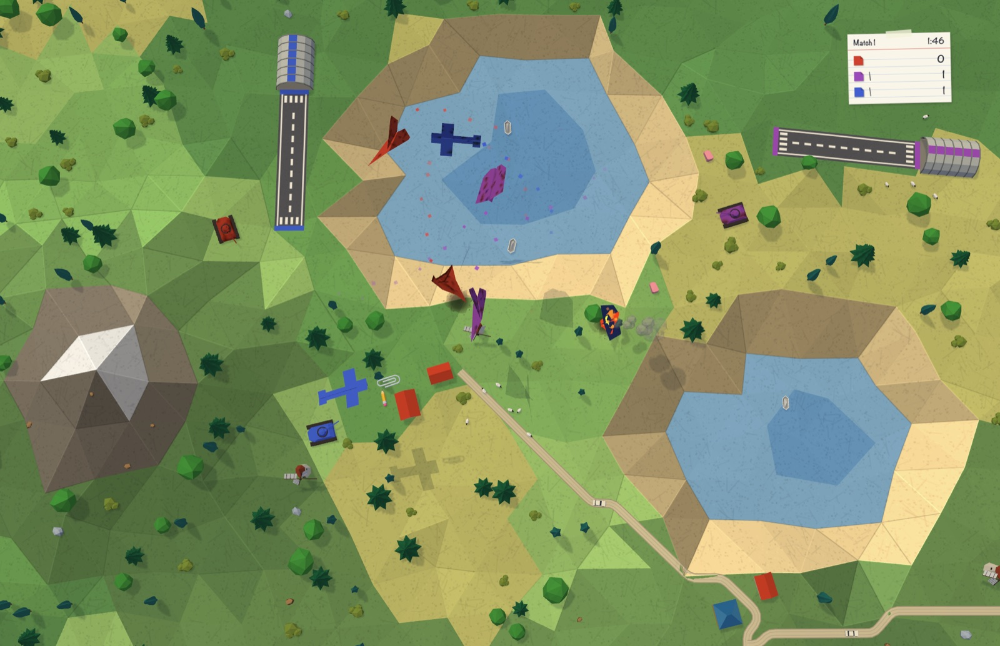

# macOS Screensavers

Screensavers for macOS 26 (Tahoe), built as real-time 3D rather than as video loops — so they
are never the same twice, and they cost a few megabytes instead of a few gigabytes.

Free, open source, no network access, no telemetry, nothing to sign up for.

---

## Aquarium

[](https://youtu.be/9DgIo6eXUYg)

**▶ [Watch it running on YouTube](https://youtu.be/9DgIo6eXUYg)**

A reef aquarium, generated fresh every time it starts. Sixteen species of fish — clownfish,
tangs, angelfish, a lionfish, a moray eel that snakes along the floor, a seahorse that stands
upright and swims by rippling its dorsal fin — swimming through a reef of coral, kelp, rock
arches and sunken ships that is laid out differently on every launch. Choose one of three
looks: a sunlit **shallow reef**, a cold and hazy **deep ocean** with god rays, or a lit glass
**aquarium** with a band of coloured gravel and twice as many ornaments. Every fish and every
rock in it is generated by a parametric script rather than downloaded, so the whole thing fits
in about 45 MB. There is optional underwater sound, and a seed you can write down to get a tank
you liked back again.

**[Full documentation, all the settings, and the fish →](Savers/Aquarium/README.md)**

### Install

1. Download `Aquarium-1.0.0.zip` from the
   [latest release](https://github.com/bman654/macos-screensavers/releases/latest) and
   double-click to unzip.

2. Install it, and clear the flag macOS puts on downloaded files:

   ```bash
   mkdir -p ~/Library/Screen\ Savers
   mv ~/Downloads/Aquarium.saver ~/Library/Screen\ Savers/
   xattr -dr com.apple.quarantine ~/Library/Screen\ Savers/Aquarium.saver
   ```

   The `xattr` line is required because the bundle is signed ad-hoc rather than notarized by
   Apple — notarization needs a paid developer account. Without it, macOS refuses to load the
   screensaver and tells you nothing about why. If you would rather not run that command,
   [build it from source](docs/development.md) instead and it will not be quarantined.

3. **Quit System Settings if it is already open**, or the new screensaver will not show up.

4. Open **System Settings → Wallpaper → "Screen Saver…"**, find the **Other** group, click
   **Show All**, and pick **Aquarium**. **Options…** has the settings.

Trouble? See [Troubleshooting](Savers/Aquarium/README.md#troubleshooting).

### Requirements

| | |
|---|---|
| **macOS** | 26.0 (Tahoe) or later — it will not load on earlier versions |
| **Hardware** | Apple Silicon only; there is no Intel build |
| **Disk** | about 45 MB |

### Uninstall

```bash
rm -rf ~/Library/Screen\ Savers/Aquarium.saver
killall legacyScreenSaver
```

---

## Origami Dogfight

[](https://github.com/bman654/macos-screensavers/releases/download/origamidogfight-1.0.0/origami-dogfight.mp4)

**▶ [Watch a 36-second clip](https://github.com/bman654/macos-screensavers/releases/download/origamidogfight-1.0.0/origami-dogfight.mp4)**

Folded paper planes dogfight over a folded-paper landscape, seen from above. Five kinds of paper
plane — the classic dart, a swept interceptor, a tailed glider, a squat bomber and a delta stunt
plane — shoot spitballs, thumbtacks, paper clips, rubber bands, staples and crumpled paper at
each other, while paper tanks on the ground throw pencils at them. A downed plane spirals in and
burns as a little origami fire, and a replacement flies in — or takes off from its team's
airfield. Aces earn stickers, supply crates drift down on tissue-paper parachutes, and a
scoreboard card keeps the tally. The landscape is folded fresh every time: summer, autumn or
winter with frozen lakes, from morning through to a moonlit night where the planes wear
glow-in-the-dark paint. About 3 MB, no sound.

**[Full documentation, all the settings, and the planes →](Savers/OrigamiDogfight/README.md)**

### Install

1. Download `OrigamiDogfight-1.0.0.zip` from its
   [release page](https://github.com/bman654/macos-screensavers/releases/tag/origamidogfight-1.0.0)
   and double-click to unzip.

2. Install it, and clear the flag macOS puts on downloaded files:

   ```bash
   mkdir -p ~/Library/Screen\ Savers
   mv ~/Downloads/OrigamiDogfight.saver ~/Library/Screen\ Savers/
   xattr -dr com.apple.quarantine ~/Library/Screen\ Savers/OrigamiDogfight.saver
   ```

   The `xattr` line is required for the same reason as the Aquarium's: the bundle is signed ad-hoc
   rather than notarized by Apple.

3. **Quit System Settings if it is already open**, or the new screensaver will not show up.

4. Open **System Settings → Wallpaper → "Screen Saver…"**, find the **Other** group, click
   **Show All**, and pick **OrigamiDogfight**. **Options…** has the settings.

Trouble? See [Troubleshooting](Savers/OrigamiDogfight/README.md#troubleshooting).

### Requirements

| | |
|---|---|
| **macOS** | 26.0 (Tahoe) or later — it will not load on earlier versions |
| **Hardware** | Apple Silicon only; there is no Intel build |
| **Disk** | about 3 MB |

### Uninstall

```bash
rm -rf ~/Library/Screen\ Savers/OrigamiDogfight.saver
killall legacyScreenSaver
```

---

## More to come

[`docs/saver-backlog.md`](docs/saver-backlog.md) has what is planned next and why it is ordered
that way.

## Building from source

Everything here is generated from code — the fish and the paper planes are parametric Blender
scripts, the bubbles are synthesis scripts, and none of it is committed as a binary. See
[`docs/development.md`](docs/development.md) for how to bake the assets and build a `.saver`
without needing Xcode.

## License

[MIT](LICENSE). That covers the models and sounds as well as the code.
