# Aquarium

A reef aquarium screensaver for macOS 26 (Tahoe). Sixteen species of fish swim through a tank
that is built fresh every time it starts — different fish, different rocks and wrecks and coral,
different gravel — and none of it is a video loop.

[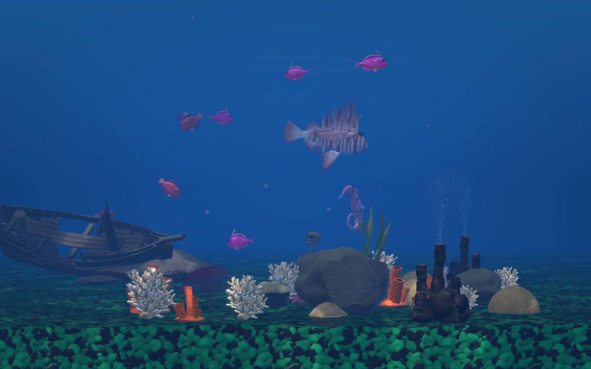](https://youtu.be/9DgIo6eXUYg)

**▶ [Watch it running on YouTube](https://youtu.be/9DgIo6eXUYg)**

---

## Contents

- [Install](#install)
- [Requirements](#requirements)
- [The three looks](#the-three-looks)
- [Settings](#settings)
- [Seeds: keeping a tank you liked](#seeds-keeping-a-tank-you-liked)
- [Sound](#sound)
- [The fish](#the-fish)
- [The decorations](#the-decorations)
- [Uninstall](#uninstall)
- [Troubleshooting](#troubleshooting)
- [Building it yourself](#building-it-yourself)

---

## Install

1. Download `Aquarium-1.0.0.zip` from the
   [latest release](https://github.com/bman654/macos-screensavers/releases/latest) and
   double-click it to unzip. You get `Aquarium.saver`.

2. Install it and clear the download flag:

   ```bash
   mkdir -p ~/Library/Screen\ Savers
   mv ~/Downloads/Aquarium.saver ~/Library/Screen\ Savers/
   xattr -dr com.apple.quarantine ~/Library/Screen\ Savers/Aquarium.saver
   ```

   **The `xattr` line is not optional, and here is exactly why it is needed.** macOS tags every
   downloaded file with a quarantine flag, and Gatekeeper will only load a quarantined bundle if
   it has been *notarized* by Apple. Notarization requires a paid Apple Developer account, which
   this project does not have, so `Aquarium.saver` is signed ad-hoc instead. Without clearing the
   flag, the screensaver simply never appears or never draws, with no error message explaining
   why. You should be suspicious of any instruction like this one — the honest version is that
   you are choosing to trust an unnotarized bundle from this repository, and if you would rather
   not, [build it from source](#building-it-yourself) instead, which produces the same thing
   without the flag.

3. **Quit System Settings if it is open.** A screensaver installed while it is running does not
   appear in the list until the app is restarted.

4. Open **System Settings → Wallpaper → "Screen Saver…"**. There is no Screen Saver pane of its
   own on Tahoe; the picker is a sheet behind that button. Scroll to the group called **Other**,
   click **Show All** (the group is collapsed to its first four entries), and pick **Aquarium**.

5. Click **Options…** in that sheet if you want to change the look, pin a tank, or turn on sound.

## Requirements

| | |
|---|---|
| **macOS** | 26.0 (Tahoe) or later. It will not load on earlier versions. |
| **Hardware** | Apple Silicon only. There is no Intel build. |
| **Disk** | About 45 MB installed. |
| **Network** | None. Everything it draws ships inside the bundle. |

It caps itself at 60 fps even on a 120 Hz ProMotion display, deliberately, for battery.

## The three looks

Pick one in Options, or choose **Surprise me** and get one of the three at every start.

### Shallow reef

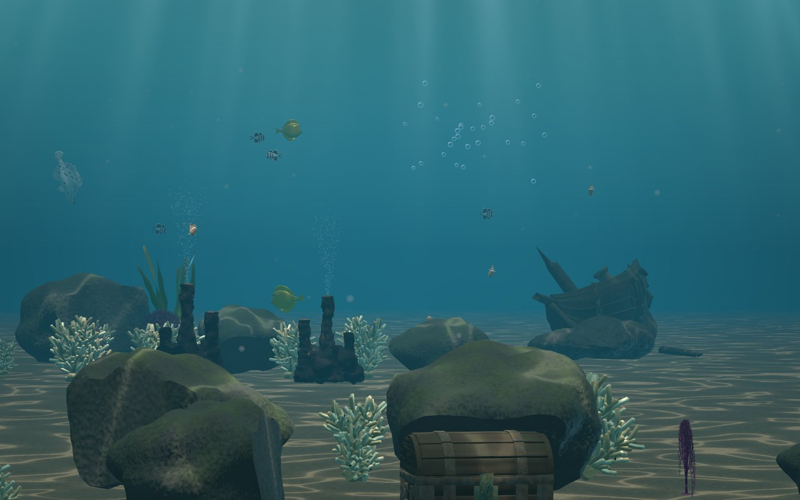

Snorkelling depth, three to five metres down. The sun is nearly overhead and still warm, so a
rippling net of caustics plays across pale sand and a broad shimmer hangs in the water. It has
the flattest haze of the three, which keeps the far reef legible instead of letting it dissolve,
and the most bloom. The brightest and most open of the looks.

### Deep ocean

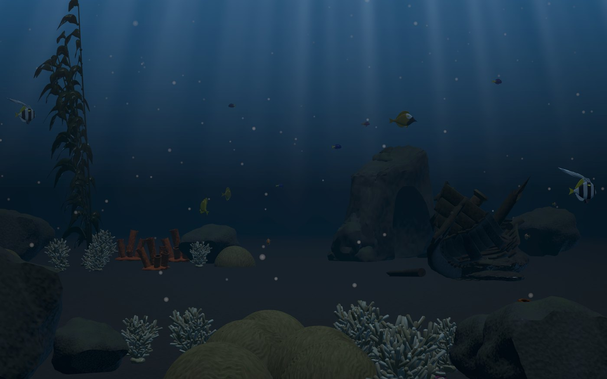

Twenty metres down. Cold blue-white light with no warmth in it anywhere, dark sand, and the
steepest haze of the three — anything more than a few metres out is already sliding into the
dark. It is the only look with god rays at full strength, the only one with no caustics at all,
and it carries the heaviest drift of marine snow.

### Aquarium

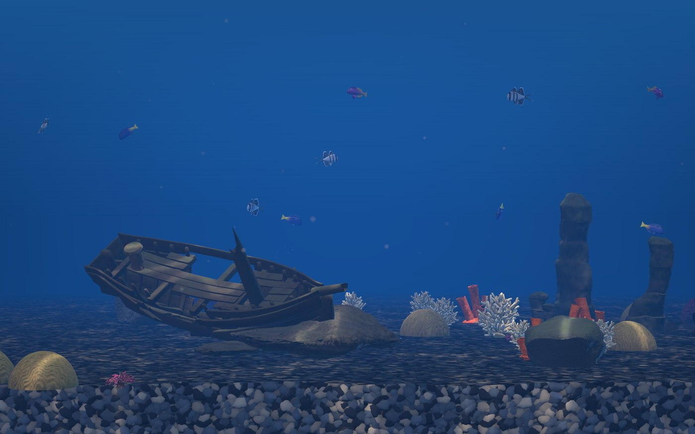

A lit glass box seen through the front pane. Fluorescent blue-white from a hood lamp, saturated
blue water, and a warm low accent grazing anything that stands upright. It is shallow front to
back and about twice as crowded with ornaments as the two ocean looks. It is also the only look
with gravel — a band of it cut open across the bottom of the frame, in a different colour every
launch, drawn from 28 palettes ranging from quiet river stone to frank aquarium-shop neon.

## Settings

Click **Options…** in the Screen Saver sheet.

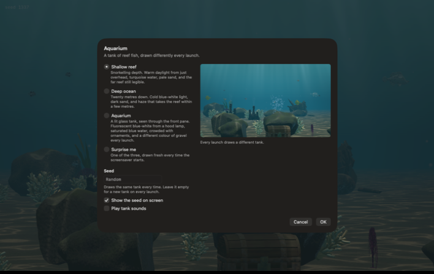

| Control | Type | Default | What it does |
|---|---|---|---|
| **Shallow reef** | radio | selected | Draws the shallow-reef look every launch. |
| **Deep ocean** | radio | | Draws the deep-ocean look every launch. |
| **Aquarium** | radio | | Draws the glass-tank look every launch. |
| **Surprise me** | radio | | Draws one of the three at random, fresh on every start. |
| **Seed** | text field | empty | Type a number to get the exact same tank every time. Leave it empty for a new tank on every launch. |
| **Show the seed on screen** | checkbox | on | Prints the tank's seed faintly in the top-left corner while the screensaver runs, so you can read it and type it back. |
| **Play tank sounds** | checkbox | **off** | Turns on the tank's ambient audio. |

The panel on the right is a real, live tank, not a still. It follows the look you have selected
and the seed you are typing, so you can see what you are choosing before you commit to it. It is
always silent and never shows the seed badge.

**Cancel** leaves everything exactly as it was. **OK** saves and redraws the running tank
immediately.

That is the whole sheet. There is no fish-count slider, no speed control, and no way to choose
the gravel colour — the tank is meant to surprise you, and the seed field is there for the times
it surprises you well.

## Seeds: keeping a tank you liked

Every tank is generated from one number. The screensaver prints it in the top-left corner as
`seed 481920`; type that number into the **Seed** field and you get that tank back, every time.
Seeds it generates for itself are six digits, short enough to read off the screen and retype.

**What the seed fixes:** which fish species are drawn and how many, each individual fish's size
and colour variant, the whole reef layout and which decorations appear, the bubblers, the god
rays and caustics, the gravel colour, and — if you have chosen **Surprise me** — which of the
three looks you get.

**What it does not fix:** the look, when you have chosen a fixed one. Style is a separate
setting, so the same seed under *Deep ocean* and under *Aquarium* gives you two different tanks.

**One caveat:** the layout is laid out against the shape of the screen it is drawn on. The same
seed on a differently shaped display gives you that seed's look, gravel and cast of fish, but
the props will not land in identical positions. This is why the small preview in the settings
sheet does not match the full-screen tank prop for prop.

The seed badge is only drawn in the real screensaver, never in the settings preview or the
picker's thumbnail.

## Sound

Off by default, on the grounds that a screensaver starts because you walked away from the
machine.

Turned on, you get the tank as heard from *inside* the water: a continuous low bubble bed from
whichever aerating props are running, a distinct puff each time one lets go — a clamshell gives
a small one, a treasure chest a big slow blorp, panned and attenuated to where that prop
actually is — and an occasional swish when a fish darts, timed so you hear it when you can also
see the fish bolt. Everything is peaked low with a short reverb and narrow stereo. Nothing is
sampled; each bubble's pitch follows from its radius.

It plays only while the screensaver is genuinely running. **The picker's thumbnail and the
settings sheet's live preview are always silent**, so "I turned sound on and the preview is
still quiet" is expected rather than a bug. Audio fades in over the first couple of seconds
rather than snapping on, and fades out as you dismiss the screensaver.

## The fish

Sixteen species. Each one is a parametric Blender script rather than a downloaded model, so a
fish's stripes, fin rays and proportions are all numbers in a file you can read. They school,
change depth, pause, graze, dart, and thread the gaps in the rock arch and the wreck.

| | Species | |
|---|---|---|
| 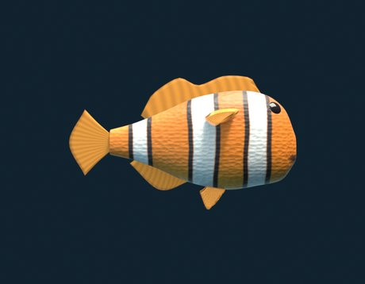 | **Clownfish**<br>*Amphiprion ocellaris* | Clownfish mature first as males; the largest fish in a group becomes female, and a dominant male changes sex if she dies. |
| 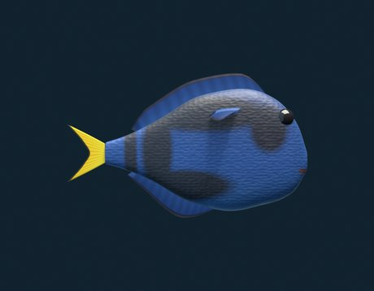 | **Blue Tang**<br>*Paracanthurus hepatus* | Adult blue tangs graze algae from reef surfaces, helping limit growth that would otherwise compete with corals for space. |
| 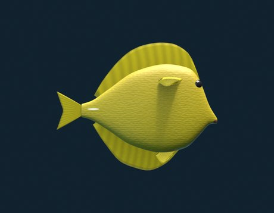 | **Yellow Tang**<br>*Zebrasoma flavescens* | Yellow tangs graze algae from hard reef surfaces, transferring energy from primary producers into the wider reef food web. |
| 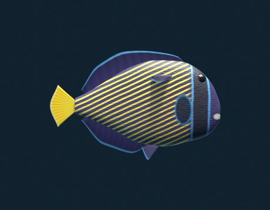 | **Emperor Angelfish**<br>*Pomacanthus imperator* | Juvenile emperor angelfish set up cleaning stations, removing parasites and dead skin from the larger reef fishes that visit them. |
| 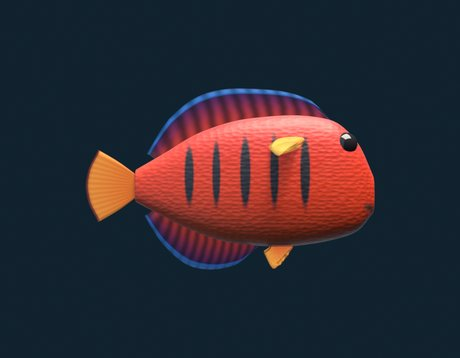 | **Flame Angelfish**<br>*Centropyge loricula* | Flame angelfish live in harems; when the dominant male disappears, a female can change sex and take his place. |
| 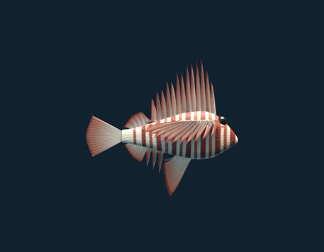 | **Red Lionfish**<br>*Pterois volitans* | An ambush predator whose venomous spines deter almost everything; introduced populations have badly reduced native reef-fish numbers in parts of the Atlantic. |
| 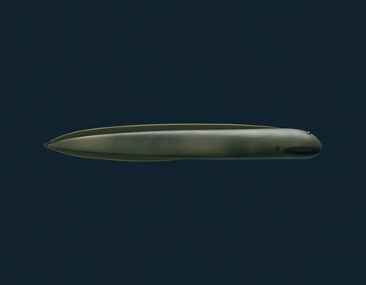 | **Green Moray Eel**<br>*Gymnothorax funebris* | Moray eels have a second set of jaws in the throat, which they launch forward to seize prey and drag it down the esophagus. |
| 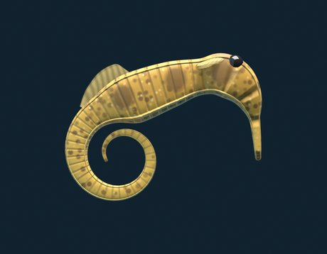 | **Common Seahorse**<br>*Hippocampus kuda* | Male seahorses brood embryos in a specialized pouch, regulating its internal chemistry before giving birth to fully formed young. |
| 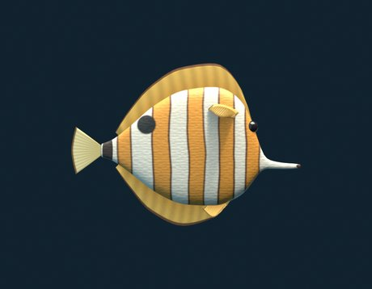 | **Copperband Butterflyfish**<br>*Chelmon rostratus* | The long snout is a tool: copperbands use it to pick worms and other small invertebrates out of crevices in the coral. |
| 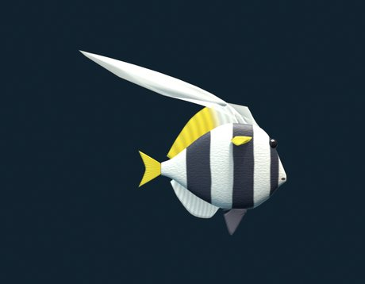 | **Longfin Bannerfish**<br>*Heniochus acuminatus* | Longfin bannerfish are usually seen in pairs or small groups, feeding on bottom-dwelling invertebrates and coral polyps. |
| 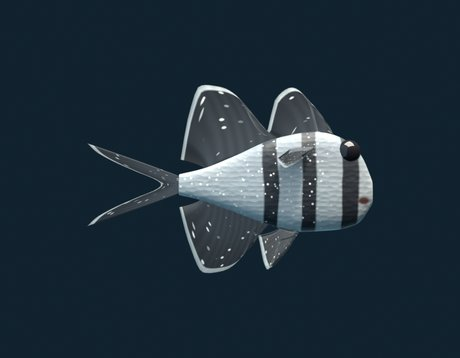 | **Banggai Cardinalfish**<br>*Pterapogon kauderni* | Males incubate the eggs and the newly hatched young in their mouths, and the species has no drifting larval stage at all. |
| 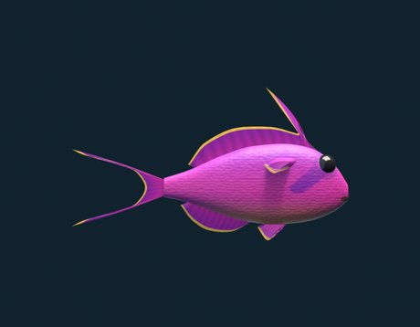 | **Lyretail Anthias**<br>*Pseudanthias squamipinnis* | Anthias live in harems dominated by one male; if he disappears, the largest female changes sex and assumes his role. |
| 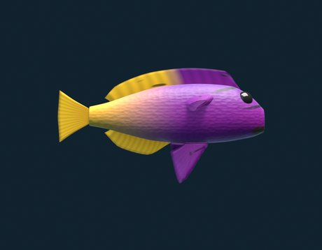 | **Royal Gramma**<br>*Gramma loreto* | Male royal grammas build nests from algae inside reef crevices and guard the eggs there until they hatch after dark. |
| 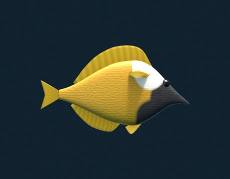 | **Foxface Rabbitfish**<br>*Siganus vulpinus* | Foxface rabbitfish carry venom in their dorsal, pelvic and anal spines, and erect them when threatened or cornered. |
| 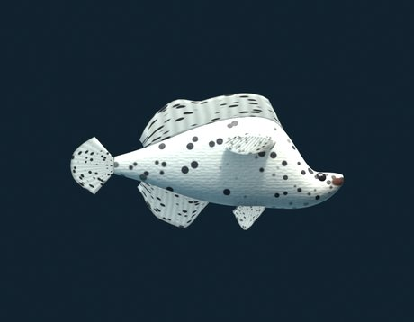 | **Panther Grouper**<br>*Cromileptes altivelis* | A solitary ambush predator that shelters around the reef and swallows fishes and crustaceans whole. |
| 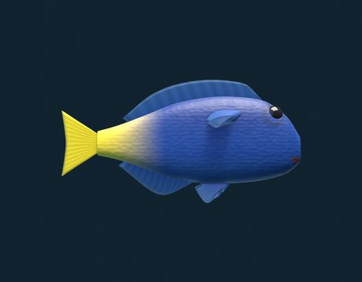 | **Yellowtail Damselfish**<br>*Chrysiptera parasema* | Yellowtail damselfish hold small territories around branching corals on shallow Indo-Pacific reefs and dive into shelter when threatened. |

The seahorse ships in six colours — amber, crimson, ivory, jade, lemon and plum — drawn per
individual, so two seahorses in one tank will not match.

A few species behave differently from the rest. The clownfish attaches itself to an anemone if
the tank drew one and stays near it. The moray eel lies along the floor and snakes through its
own turns rather than pivoting like a plank. The seahorse stands upright, holds itself rigid,
and moves by rippling its dorsal fin.

## The decorations

Sixteen more models, placed and spaced by the same seed: anemone, boulder, brain coral,
clamshell, diving suit (helmeted, with a bubble stream), giant kelp, kelp, rock arch, rock
pillars, sea fan, skeleton with jug, staghorn coral, sunken ship, thermal vent, treasure chest,
and tube sponge. The arch and the wreck have holes in them that fish will actually route
through rather than swim around.

## Uninstall

```bash
rm -rf ~/Library/Screen\ Savers/Aquarium.saver
killall legacyScreenSaver
```

Then pick a different screensaver in System Settings → Wallpaper → "Screen Saver…".

## Troubleshooting

**It does not appear in the list.** System Settings was open when you installed it. Quit System
Settings entirely and reopen it. Also check that you clicked **Show All** under the **Other**
group — it only shows four entries until you do.

**It appears but the screen stays black, or it never starts.** The quarantine flag is almost
certainly still set. Run `xattr -l ~/Library/Screen\ Savers/Aquarium.saver` — if you see
`com.apple.quarantine`, clear it with the `xattr -dr` command in [Install](#install), then
`killall legacyScreenSaver`.

**The thumbnail in the picker is stale after reinstalling.** macOS caches those tiles
aggressively. `killall WallpaperAgent` and reopen System Settings.

**I turned on sound and hear nothing.** The preview and thumbnail are silent by design; you only
hear the tank once the screensaver is actually running. Sound also fades in over the first
couple of seconds.

**I want the same tank back and did not write the seed down.** There is no history — the seed is
the only handle. Turn on **Show the seed on screen** so the next one you like is recoverable.

## Building it yourself

Building the `.saver` itself needs only Command Line Tools. Regenerating the models and sounds
needs Blender, because they are generated from scripts rather than committed as binaries.

```bash
tools/build-library.py                # bake the 32 models (needs Blender 4.2+)
tools/build-audio.py                  # bake the grain library
tools/build-saver.sh Aquarium -i      # compile, bundle, sign, install
```

See [`docs/development.md`](../../docs/development.md) for the full setup, and
[`../../CLAUDE.md`](../../CLAUDE.md) plus the `docs/` folder for how the thing is put together
and every trap found along the way.

## License

MIT — see [LICENSE](../../LICENSE) at the root of the repository. That covers the fish as well
as the code; the models are Python scripts in `Models/`.
