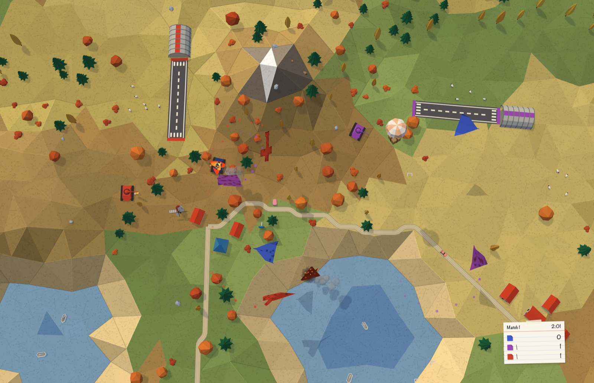
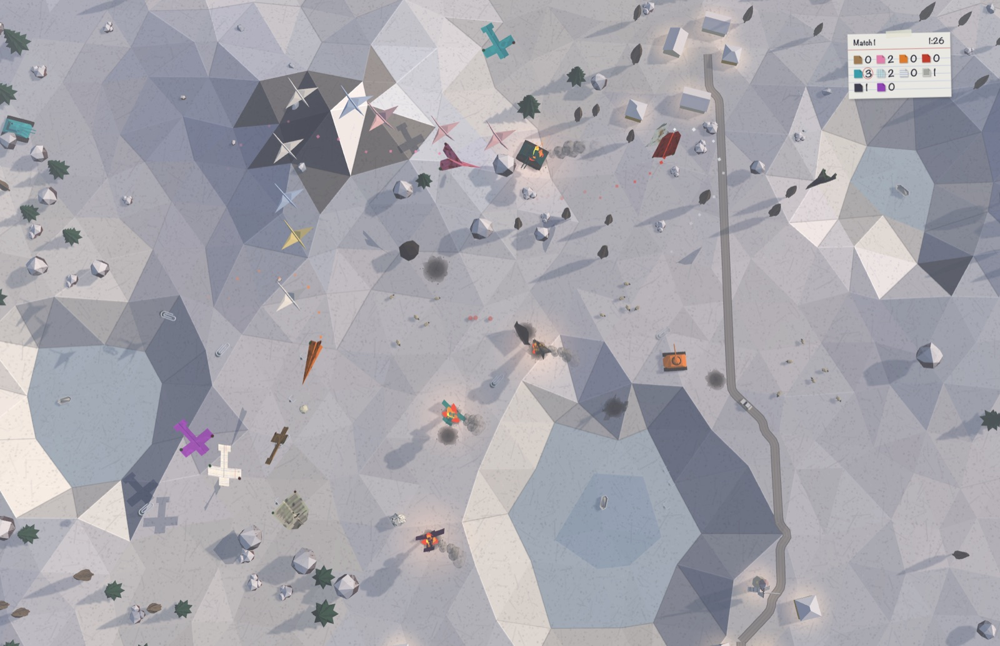
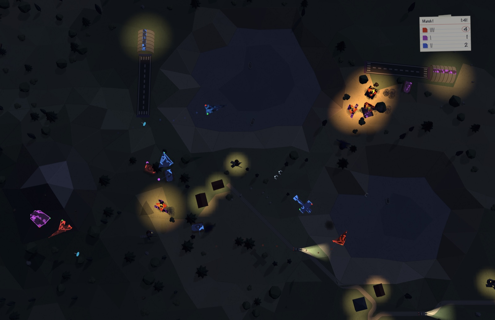
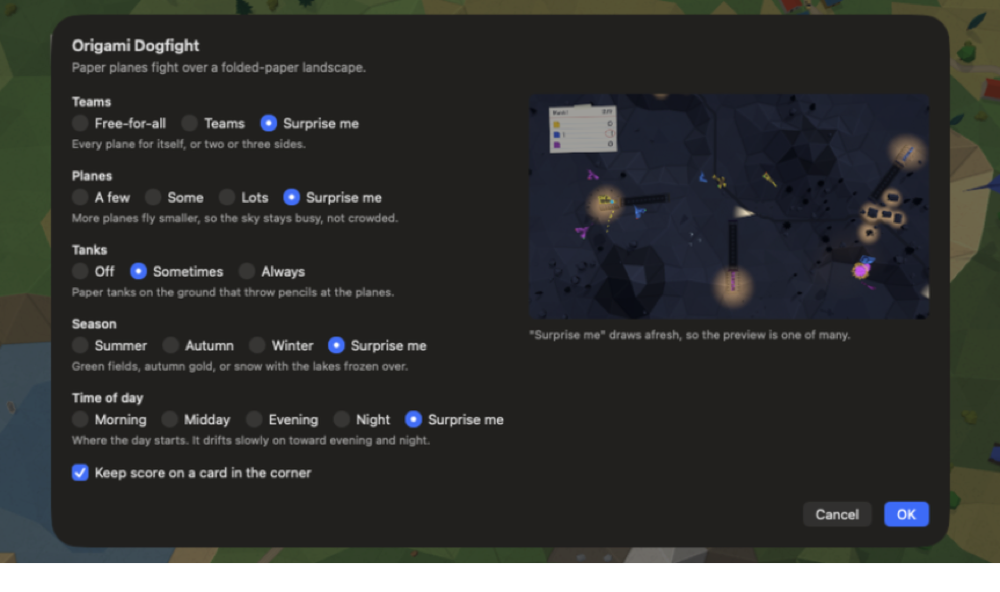
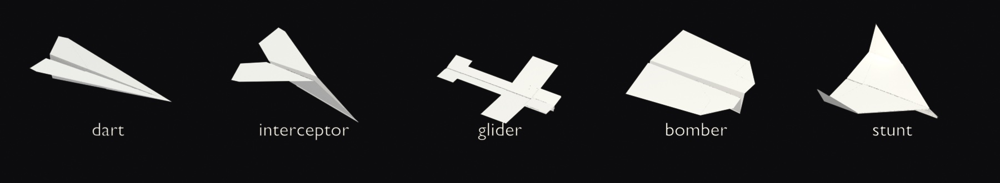
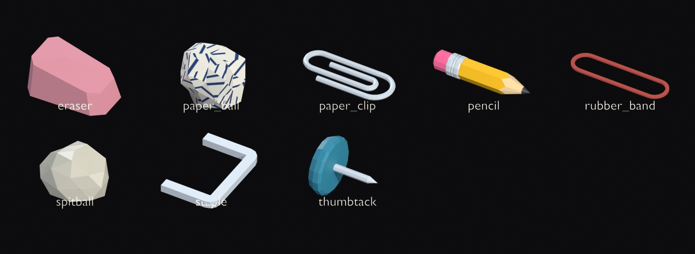
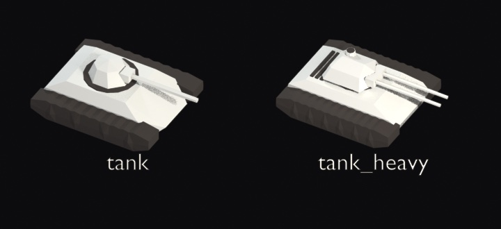

# Origami Dogfight

A screensaver for macOS 26 (Tahoe): folded paper planes dogfight over a folded-paper
landscape, seen from above. They shoot spitballs, paper clips, staples and crumpled paper at each
other; paper tanks on the ground throw pencils at them. A plane that is shot down spirals in and
burns as a little origami fire, and a new one flies in to take its place. The landscape is folded
fresh every time it starts, and none of it is a video loop.

[](https://youtu.be/hAXJKLrM_hM)

**▶ [Watch it running on YouTube](https://youtu.be/hAXJKLrM_hM)**

---

## Contents

- [Install](#install)
- [Requirements](#requirements)
- [What you are watching](#what-you-are-watching)
- [Seasons and time of day](#seasons-and-time-of-day)
- [Settings](#settings)
- [The planes](#the-planes)
- [The ammunition](#the-ammunition)
- [Tanks](#tanks)
- [Uninstall](#uninstall)
- [Troubleshooting](#troubleshooting)
- [Building it yourself](#building-it-yourself)

---

## Install

1. Download `OrigamiDogfight-1.0.0.zip` from the
   [release page](https://github.com/bman654/macos-screensavers/releases/tag/origamidogfight-1.0.0)
   and double-click it to unzip. You get `OrigamiDogfight.saver`.

2. Install it and clear the download flag:

   ```bash
   mkdir -p ~/Library/Screen\ Savers
   mv ~/Downloads/OrigamiDogfight.saver ~/Library/Screen\ Savers/
   xattr -dr com.apple.quarantine ~/Library/Screen\ Savers/OrigamiDogfight.saver
   ```

   **The `xattr` line is not optional.** macOS tags every downloaded file with a quarantine
   flag, and will only load a quarantined screensaver if Apple has *notarized* it. Notarization
   needs a paid Apple Developer account, which this project does not have, so the bundle is signed
   ad-hoc instead. Without clearing the flag the screensaver simply never appears or never draws,
   and nothing tells you why. Running that line means you are choosing to trust an unnotarized
   bundle from this repository; if you would rather not, [build it from
   source](#building-it-yourself), which produces the same thing with no flag to clear.

3. **Quit System Settings if it is open.** A screensaver installed while it is running does not
   appear in the list until the app is restarted.

4. Open **System Settings → Wallpaper → "Screen Saver…"**. There is no Screen Saver pane of its
   own on Tahoe; the picker is a sheet behind that button. Scroll to the group called **Other**,
   click **Show All**, and pick **OrigamiDogfight**.

5. Click **Options…** in that sheet to choose teams, how many planes, tanks, the season and the
   time of day.

## Requirements

| | |
|---|---|
| **macOS** | 26.0 (Tahoe) or later. It will not load on earlier versions. |
| **Hardware** | Apple Silicon only. There is no Intel build. |
| **Disk** | About 3 MB installed. |
| **Network** | None. Everything it draws ships inside the bundle. |

It caps itself at 60 fps even on a 120 Hz display, for battery, and costs about 1–3 ms of GPU
time a frame.

## What you are watching

- **Matches.** Each match picks how many planes are in the air and whether it is a free-for-all
  or two or three teams. A match ends when enough planes have gone down or after two and a half
  minutes; the scoreboard names the winner, the survivors fly off, and the next match begins over
  the same landscape.
- **Shot down.** A hit throws confetti in the colour of the plane's paper; a damaged plane shows
  smudges and scorch marks that get worse as it weakens. A plane that is shot down spirals in
  trailing smoke and burns nose-down under a folded-paper fire. Into a lake it splashes and
  sinks instead. Now and then two planes collide and both crumple.
- **Replacements.** A new plane for the same side flies in from the edge of the screen. In a team
  match, each team has its own airfield — a paper runway and a hangar in the team colour that
  unfold when the match starts — and replacements take off from it.
- **Aces.** A plane that scores three, five and eight kills in a match earns a sticker on its
  wing: a silver star, a smiley or a heart, then a gold star, then a rainbow. The scoreboard shows
  them too.
- **Supply drops.** Every so often a paper crate drifts down on a tissue-paper parachute. The
  first plane through it gets triple shot or rapid fire for fifteen seconds.
- **The scoreboard** is a small index card with pencil tallies, in a different corner every match
  so nothing stays in one place long enough to burn into the screen. It can be turned off.
- **The countryside** goes on around the fight: villages joined by paper roads with little cars,
  windmills turning, sheep grazing (they get out of the way of tanks and runways), paper boats on
  the lakes, and now and then a flock of paper cranes crossing overhead. Crashes leave scorch
  marks, and a crash beside a tree can set it alight; the ground is cleaned up between matches.

## Seasons and time of day



**Autumn** turns the woods orange and red and the fields gold.



**Winter** covers everything in white paper. The lakes freeze over and count as ground: shots lie
on the ice, wrecks burn on it, tanks drive across it, and the boats are frozen in place.



**Time of day** runs from morning (low sun from the east, long shadows, a little haze) through
midday to evening (low red sun, long shadows, lamplight coming on) and **night** — moonlit and
dark, lit by lamplight, fires and car headlamps. At night the planes and tanks show
glow-in-the-dark paint in their team colours, with a red and a green dot on the wingtips, and
the shots glow too. Over a long session the day drifts slowly on toward evening and night.

## Settings



| Setting | Choices |
|---|---|
| **Teams** | Free-for-all · Teams · Surprise me |
| **Planes** | A few (3–4) · Some (5–7) · Lots (8–12) · Surprise me |
| **Tanks** | Off · Sometimes · Always |
| **Season** | Summer · Autumn · Winter · Surprise me |
| **Time of day** | Morning · Midday · Evening · Night · Surprise me |
| **Keep score on a card in the corner** | on or off |

**Surprise me** draws again for every match (for the season and the time of day, every time the
screensaver starts). More planes fly smaller, along with everything they carry, so a busy sky
stays readable rather than crowded. The landscape never changes size.

## The planes



Each is folded from a real sheet of letter paper — so a notebook page keeps its ruled lines
running across the folds — and in a free-for-all each plane flies a different paper: lined
notebook, graph paper, newspaper, kraft or plain coloured.

| Plane | What it is | Flies | Weapons |
|---|---|---|---|
| **Dart** | The classic dart everyone folds first | fastest, wide turns, fragile | spitballs or thumbtacks |
| **Interceptor** | Needle nose, swept wings | fast and agile, fragile | rubber bands or thumbtacks |
| **Glider** | Wide wings and a tail | slow and very nimble | paper clips or eraser crumbs |
| **Bomber** | Squat, blunt and boxy | slowest, toughest | crumpled paper balls or hole-punch confetti |
| **Stunt** | Delta wing with upturned tips | quick and agile | staples in bursts of three |

## The ammunition



Shots fly at the shooter's height and drop as they go — the crumpled paper ball drops fast — and
a miss falls to the ground and lies there for a few seconds before it fades. A shot that lands in
a lake splashes and sinks.

## Tanks



A light tank and a heavy one with twin barrels, in their side's colour. They drive over dry,
gentle ground, stop to aim, and throw pencil stubs steeply up at the planes overhead. Planes
attack them in shallow strafing dives, and the bomber drops its crumpled paper balls on them. A
destroyed tank burns like a crashed plane, and a new one rolls in — out of its team's hangar, in
a team match.

## Uninstall

```bash
rm -rf ~/Library/Screen\ Savers/OrigamiDogfight.saver
killall legacyScreenSaver
```

Then pick a different screensaver in System Settings → Wallpaper → "Screen Saver…".

## Troubleshooting

**It does not appear in the list.** System Settings was open when you installed it. Quit System
Settings entirely and reopen it. Also check that you clicked **Show All** under the **Other**
group — it only shows four entries until you do.

**It appears but the screen stays black, or it never starts.** The quarantine flag is almost
certainly still set. Run `xattr -l ~/Library/Screen\ Savers/OrigamiDogfight.saver` — if you see
`com.apple.quarantine`, clear it with the `xattr -dr` command in [Install](#install), then
`killall legacyScreenSaver`.

**The thumbnail in the picker is stale after reinstalling.** macOS caches those tiles
aggressively. `killall WallpaperAgent` and reopen System Settings.

**Options… stops opening.** This has been seen once, after a long full-screen Preview, and has
not been reproduced since. Quitting System Settings and opening it again fixes it.

## Building it yourself

Building the `.saver` itself needs only Command Line Tools. Regenerating the models needs
Blender, because every plane, tank and tree is generated from a script rather than committed as
a binary.

```bash
tools/build-origami-library.py                # fold the 33 models (needs Blender 4.2+)
tools/build-saver.sh OrigamiDogfight -i       # compile, bundle, sign, install
```

See [`docs/development.md`](../../docs/development.md) for the full setup, and
[`docs/origami-plan.md`](../../docs/origami-plan.md) for how the saver is put together and why.

## License

MIT — see [LICENSE](../../LICENSE) at the root of the repository. That covers the models as well
as the code; they are Python scripts in `Models/`.
